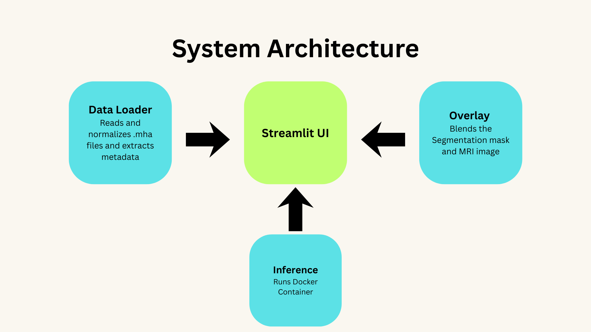
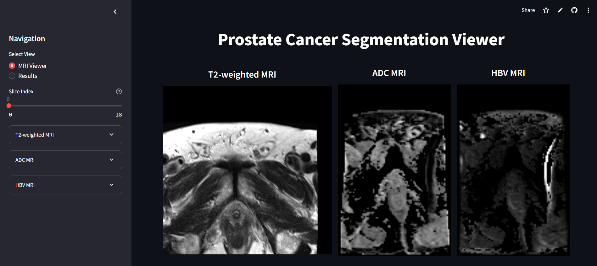
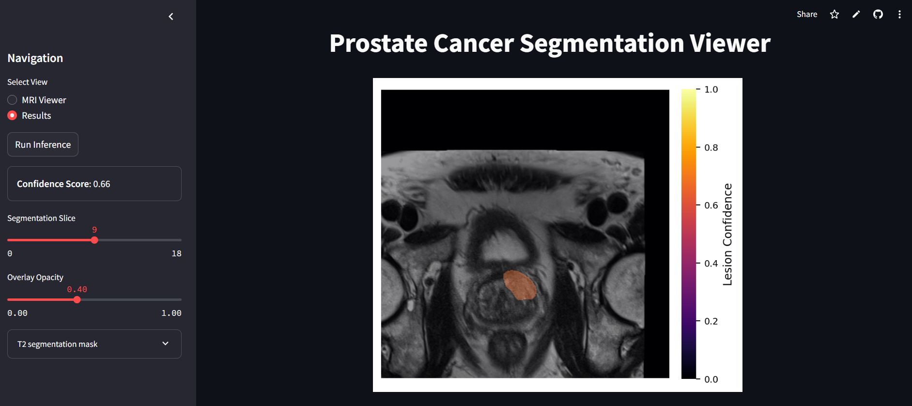

# ProstateSeg Viewer  
A modular, lightweight tool for visualizing multi-modal prostate MRI with integrated tumor segmentation overlays, probability heatmaps, and case-level confidence score.

## Live Demo
Try ProstateSeg Viewer in Action - [https://picai-segmentation-viewer-tjn6safugwdfkvtdweuo4a.streamlit.app/](https://picai-segmentation-viewer-tjn6safugwdfkvtdweuo4a.streamlit.app/)


## Tech Stack
- **Python** — core logic
- **Streamlit** — interactive UI
- **SimpleITK** — MRI loading & I/O
- **NumPy & OpenCV** — image processing
- **Matplotlib** — visualization utilities

## Key Features
### **Multi-Modal MRI Viewer**
- Supports **T2**, **ADC**, and **HBV** MRI volumes  
- Slice-by-slice navigation using sliders  
- Automatic metadata loading (dimensions, voxel spacing, modality info)  

### **Tumor Segmentation Mask Overlay**
- Overlays tumor segmentation masks on MRI via alpha blending  
- Heatmap generation using per-voxel probability values  
- Adjustable blending option 
- Displays model-generated confidence score

### **Modular Code Structure**
- `utils/data_loader.py` - MRI & mask loading utilities  
- `inference.py` - PICAI nnUNet inference via Docker  
- `overlay.py` - segmentation overlay logic  
- `app.py` - Streamlit interface  
- Easily extendable to new modalities, segmentation models, or viewer layouts  
- Clean separation between **UI**, **data processing**, and **ML logic**  

## System Architecture 
<p align="center">
  
</p>

## Screenshots  
<p float="left">
  
  
</p>

## Setup & Run
1. Clone the repository
```
   git clone <repo-url>
```

2. Install dependencies:
```
pip install -r requirements.txt
```

3. Run Streamlit App
```
streamlit run app.py
```

